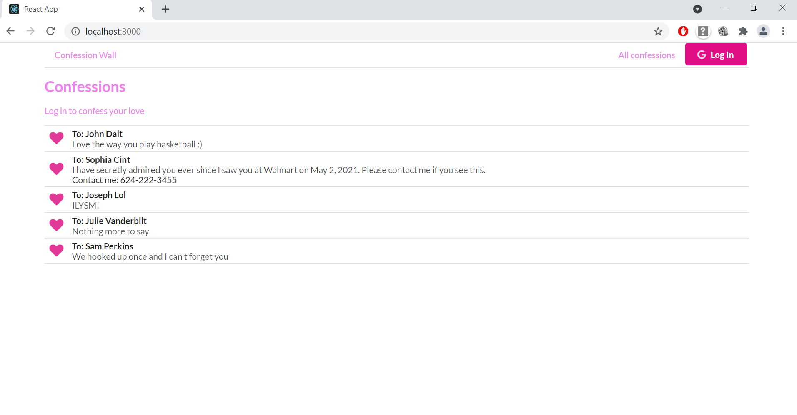
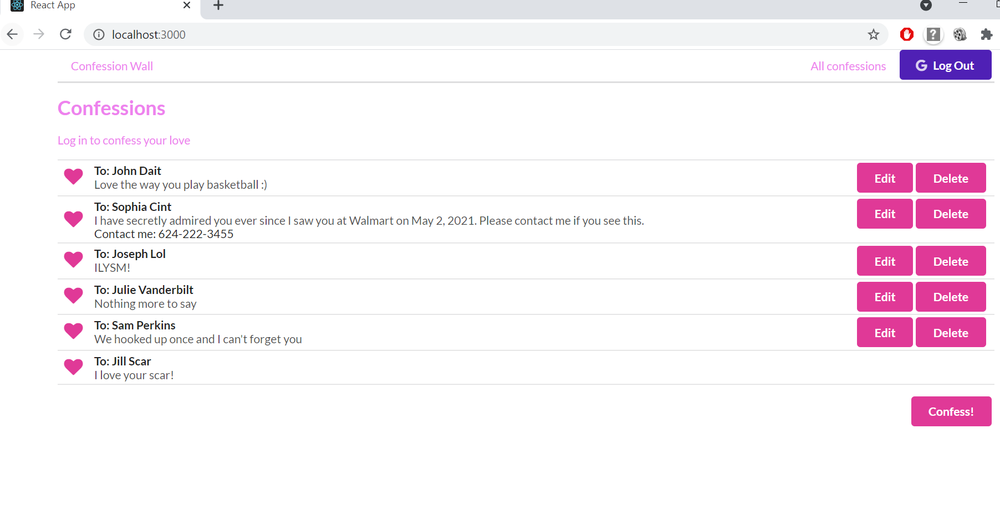
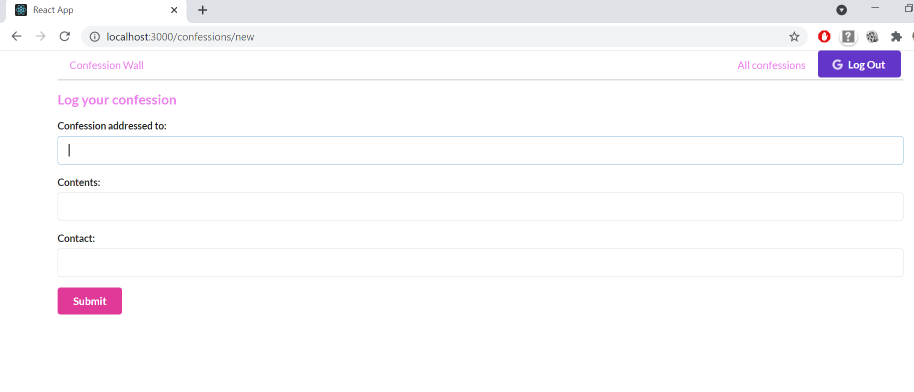
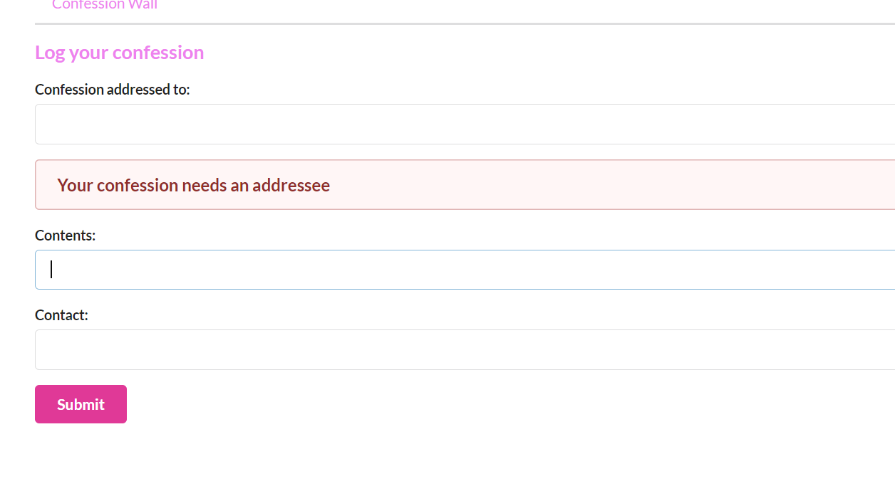
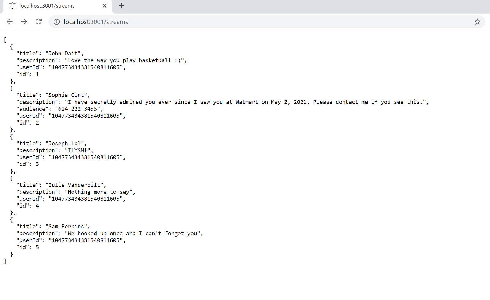
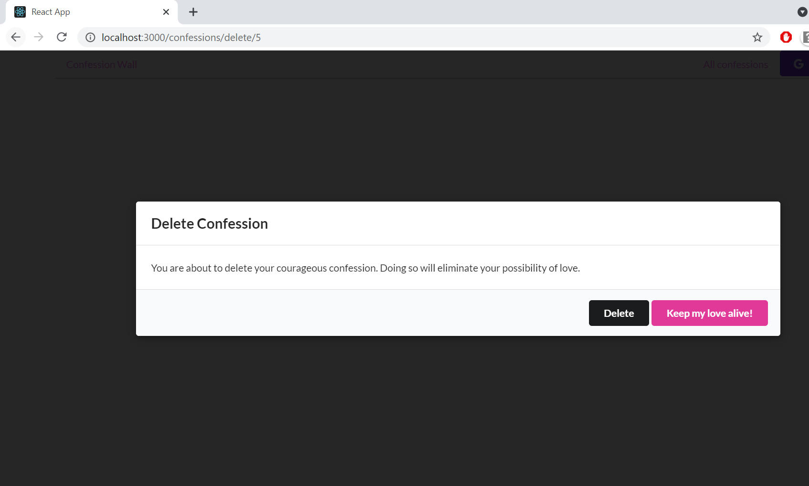

# Confession-Wall

This is a Confession Wall Web App created using React and Redux
The database is a simple JSON Server Restful API and the authentication is handled using Google OAuth.

Adapted from Udemy course tutorial on React and Redux by Stephen Grider

This is a confession wall for people to confess their love

You can create and edit your confessions after logging in:

The data is stored on a db.json file:

If you regret your confession, you can delete:

